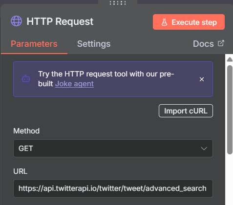
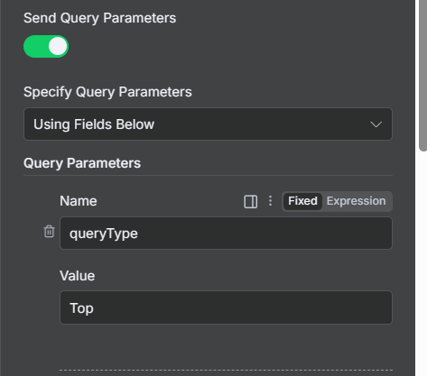
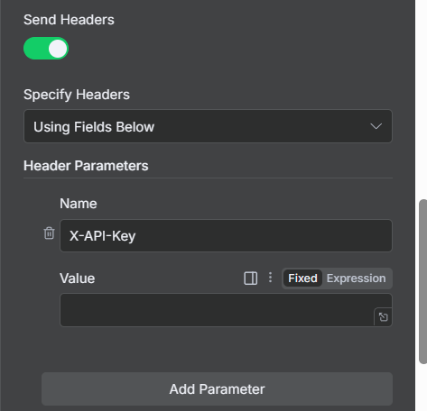
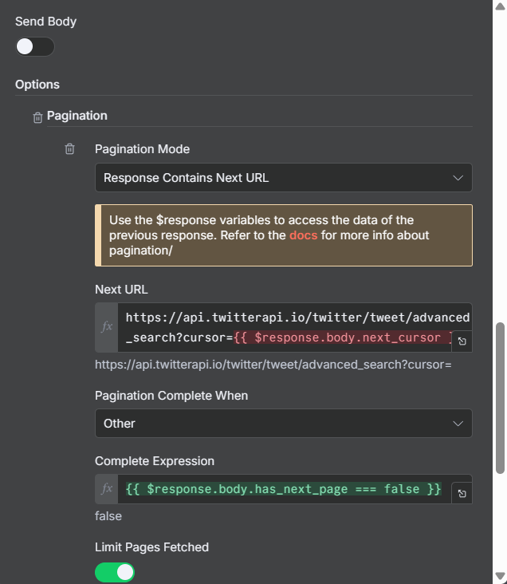
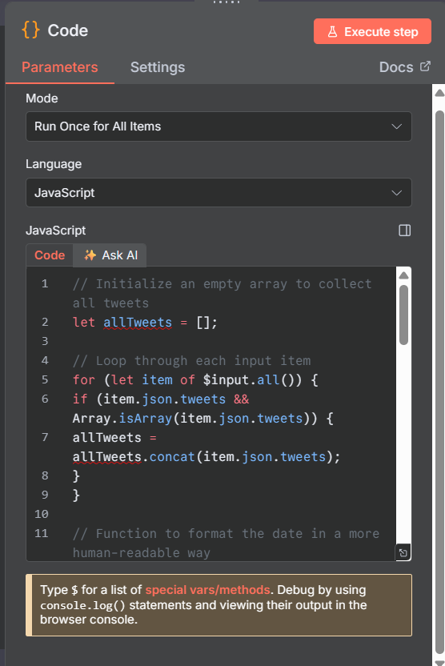

# X - Scrapping Agent

- **STEP 1** - **TRIGGER -** When Chat Message Received
- **STEP 2** - **HTTP Request**

URL - `https://api.twitterapi.io/twitter/tweet/advanced_search`









NEXT URL

`https://api.twitterapi.io/twitter/tweet/advanced_search?cursor={{ $response.body.next_cursor }}`

Complete Expression

`{{ $response.body.has_next_page === false }}`

- **STEP 3** - Code Node



**COPY THIS:**

```
// Initialize an empty array to collect all tweets
let allTweets = [];

// Loop through each input item
for (let item of $input.all()) {
if (item.json.tweets && Array.isArray(item.json.tweets)) {
allTweets = allTweets.concat(item.json.tweets);
}
}

// Function to format the date in a more human-readable way
function formatDate(dateString) {
if (!dateString) return '';

try {
const date = new Date(dateString);
return date.toLocaleString('en-US', {
year: 'numeric',
month: 'long',
day: 'numeric',
hour: '2-digit',
minute: '2-digit'
});
} catch (error) {
console.log("Error formatting date:", error);
return dateString;
}
}

// Remove duplicates by tweet ID
const seen = new Set();
const uniqueTweets = [];

for (const tweet of allTweets) {
const id = tweet.id;
if (!seen.has(id)) {
seen.add(id);
uniqueTweets.push(tweet);
}
}

// Format the cleaned-up tweets
const formattedTweets = uniqueTweets.map(tweet => ({
json: {
tweetId: tweet.id || '',
url: tweet.url || '',
content: tweet.text || '',
likeCount: tweet.likeCount || 0,
retweetCount: tweet.retweetCount || 0,
replyCount: tweet.replyCount || 0,
quoteCount: tweet.quoteCount || 0,
viewCount: tweet.viewCount || 0,
bookmarkCount: tweet.bookmarkCount || 0,
createdAt: formatDate(tweet.createdAt)
}
}));

// Output all tweets as separate items
return formattedTweets;
```

- **STEP 4** - AIRTABLE CONNECTION - Copy this base directly

`https://airtable.com/appsp6xaDnfaXjMYX/shrlUuf3UReFaojHA`
