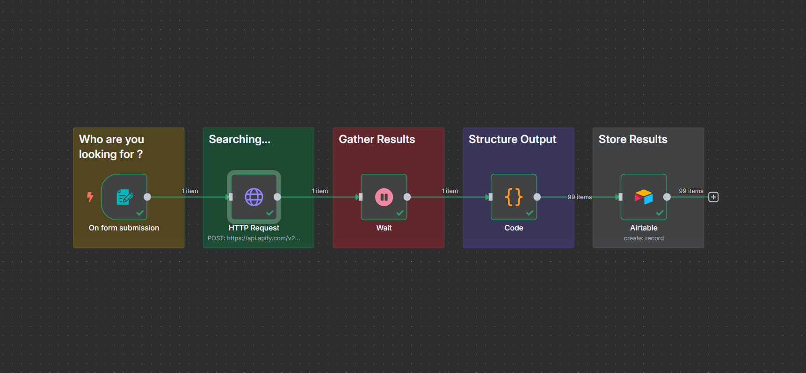

# 🚀 Instagram Data Scraper Workflow



This workflow uses **Apify Google Search Scraper** + **Code Node** to extract structured Instagram creator data from Google search results.

✨ Perfect for automating influencer research, lead generation, and audience analysis!

---

## 🔗 **Workflow Overview**

1. 🌐 **HTTP Node**

   - Calls the Apify Google Search Scraper API.
   - Queries Instagram profiles based on **Account Type** and **Location**.
   - Retrieves raw JSON with organic search results.

2. 🧑‍💻 **Code Node**

   - Cleans and processes raw data.
   - Extracts Instagram **name, handle, followers, description, profile URL, and more**.
   - Converts follower counts like `22.7K`, `1.2M`, into exact numbers (`22700`, `1200000`).

---

## ⚙️ **HTTP Node Setup**

**URL**:

```
https://api.apify.com/v2/acts/apify~google-search-scraper/run-sync-get-dataset-items?token=apify_api_YOUR_API_KEY
```

**JSON Payload**:

```json
{
  "focusOnPaidAds": false,
  "forceExactMatch": false,
  "includeIcons": false,
  "includeUnfilteredResults": false,
  "maxPagesPerQuery": 3,
  "mobileResults": false,
  "queries": "site:instagram.com + {{ $json['Account Type'] }} {{ $json.Location }}",
  "resultsPerPage": 100,
  "saveHtml": false,
  "saveHtmlToKeyValueStore": true
}
```

---

## 📝 **Code Node Logic**

### 🔍 Parse Followers Function

- Converts shorthand followers into actual numbers:

  - `22.7K → 22700`
  - `1.2M → 1200000`
  - `3.4B → 3400000000`

### ⚡ Main Processing

- Extracts and structures each Instagram profile:

```javascript
return creators.map((creator) => {
  const titleSplit = creator.title.split("(@");
  const name = titleSplit[0]?.trim() || "Unknown";
  const handle = titleSplit[1]?.split(")")[0] || "";

  const rawFollowers = creator.followersAmount || "";
  const cleanFollowers = parseFollowers(rawFollowers);

  return {
    json: {
      Name: name,
      InstagramHandle: handle,
      ProfileURL: creator.url || "",
      Description: creator.description || "",
      Followers: cleanFollowers,
      ChannelName: creator.channelName || "",
      PostType: creator.type || "",
      Position: creator.position || null,
    },
  };
});
```

---

## 📊 **Output Example**

```json
{
  "Name": "John Doe",
  "InstagramHandle": "johndoe",
  "ProfileURL": "https://instagram.com/johndoe",
  "Description": "Fashion Blogger | Lifestyle | Travel",
  "Followers": 12500,
  "ChannelName": "John Doe",
  "PostType": "organic",
  "Position": 1
}
```

---

## ✅ **Features**

- 🔎 Accurate Instagram profile scraping via Google.
- 🔢 Converts followers into precise integers.
- 📦 Structured JSON output ready for further automation.
- ⚡ Scales across multiple queries and locations.

---

## 🚀 Use Cases

- 👩‍💼 Influencer Marketing Research
- 📈 Competitor Analysis
- 🧑‍🤝‍🧑 Lead Generation
- 🌍 Location-based Creator Discovery
