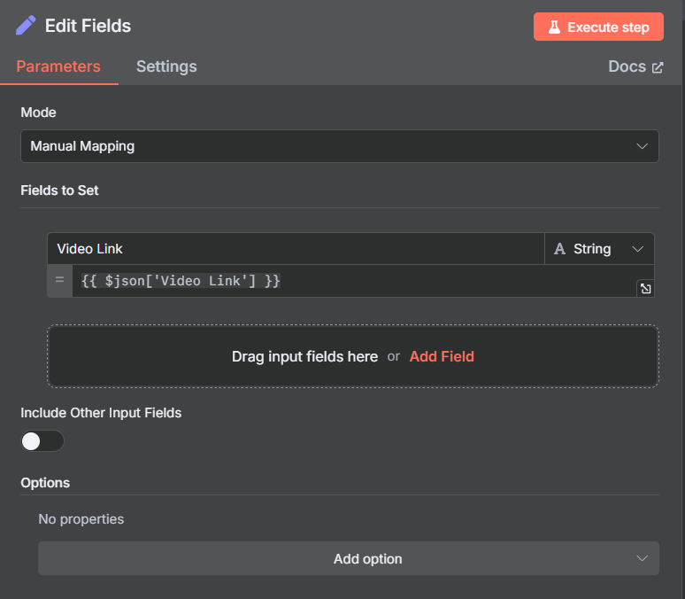

# 🎬 YouTube Description & Title AI Agent 🤖✨


---

## 🧠 Overview

This AI-powered workflow helps you **automatically generate SEO-optimized YouTube descriptions & catchy titles**.
It’s built to run **hands-free, scheduled, and repeatable** 🚀

### 🔑 Key Features

- 📥 Reads video links directly from Google Sheets
- 🆔 Extracts YouTube video IDs
- 📜 Fetches & merges full transcripts
- 📝 Summarizes and optimizes with **OpenAI LLM & Agent**
- 📧 Sends results via Email
- 📊 Updates the Google Sheet with fresh outputs

---

## ⚙️ Workflow Breakdown

### ⏰ 1. Trigger

- **Node**: `Schedule Trigger`
- **Purpose**: Runs daily/hourly as per schedule

---

### 📊 2. Data Input

- **Node**: `Google Sheets (Read)`
- **Purpose**: Fetches YouTube video links
- **Note**: Make sure credentials & columns are mapped correctly

---

### 🔄 3. Loop Over Items

- **Node**: `Loop Over Items`
- **Purpose**: Iterates over each video link

---

### 🔗 4. Extract Link

- **Node**: `Set / Manual`
- **Purpose**: Captures the video link for parsing

## 

---

### 🧑‍💻 5. Code Node (Extract Video ID)

```js
return items.map((item) => {
  const videoLink = item.json["Video Link"];
  const match = videoLink.match(/(?:v=|\/)([0-9A-Za-z_-]{11})/);
  const videoId = match ? match[1] : null;

  return {
    json: {
      "Video Link": videoLink,
      video_id: videoId,
    },
  };
});
```

---

### 🌐 6. Fetch Transcripts

- **Node**: `HTTP Request`
- **API**: RapidAPI → [YouTube Video Summarizer GPT AI](https://rapidapi.com/rahilkhan224/api/youtube-video-summarizer-gpt-ai)
- **Example cURL**:

```bash
curl --request GET \
  --url 'https://youtube-video-summarizer-gpt-ai.p.rapidapi.com/api/v1/get-transcript-v2?video_id=RXeOiIDNNek&platform=youtube' \
  --header 'x-rapidapi-host: youtube-video-summarizer-gpt-ai.p.rapidapi.com' \
  --header 'x-rapidapi-key: YOUR_API_KEY'
```

---

### 📝 7. Extract Transcript Data

- **Node**: `Set / Manual`
- **Purpose**: Parse & filter transcript chunks

[Extract Transcript](./image2.png)

---

### 🧩 8. Combine Transcript Chunks

```js
const transcriptChunks = items[0]?.json?.data?.transcripts?.hi_auto?.custom;

if (!Array.isArray(transcriptChunks)) {
  throw new Error("Transcript chunks not found or not in expected format.");
}

let combinedText = "";

for (const chunk of transcriptChunks) {
  if (chunk?.text) {
    combinedText += chunk.text.trim() + " ";
  }
}

return [
  {
    json: {
      combinedTranscript: combinedText.trim(),
    },
  },
];
```

---

### 🤖 9. Processing with LLM Chain

- **Node**: `Basic LLM Chain`
- **Model**: OpenAI Chat Model
- **Prompt Goal**: Generate **killer YouTube descriptions** + **SEO tags & hashtags**

---

### 🎯 Prompt Highlights

- Hook → Catchy 1–2 lines ✨
- 3–6 sentence overview 📄
- Call to Actions (Subscribe, Like, Watch Next) 🔔
- End Blocks:

  - SEO Meta Tags 🏷️
  - Hashtags #️⃣

⚠️ **Rules:**

- ❌ No boring “In this video…” starts
- ✅ Must include CTAs, tags, hashtags
- ✅ Human-readable, not keyword-stuffed

---

### 🧑‍🚀 10. Agent Execution (Titles)

- **Node**: `AI Agent`
- **Purpose**: Generate catchy, click-worthy video titles

---

### 🛠️ 11. Data Prep

- **Node**: `Code / Set`
- **Purpose**: Format results for email & Google Sheet updates

---

### 📧 12. Email Notification

- **Node**: `Gmail`
- **Purpose**: Send processed descriptions & titles directly to your inbox

---

### 📊 13. Google Sheets Update

- **Node**: `Google Sheets (Update)`
- **Purpose**: Write results back to the same sheet (status + outputs)

---

## 🚀 Benefits

- 🎯 **SEO-optimized content** that ranks better
- ⚡ **Time-saving automation** (no manual writing)
- 📈 **Higher CTR** with engaging hooks & CTAs
- 🔁 Fully repeatable & scalable

---

## 📌 Example Output

**🎥 Input Summary:**
“A 10-minute video on ChatGPT + Airtable with N8N automation demo.”

**📄 AI Output:**
👉 Hook: _“Want to automate your business with AI? Here’s how 🚀”_
👉 Overview: 3–6 sentences covering integration & tips
👉 CTA: Subscribe + Watch Next prompts
👉 SEO Tags + Hashtags block at end

---

✨ With this agent, your YouTube workflow becomes **smarter, faster, and SEO-friendly**!
