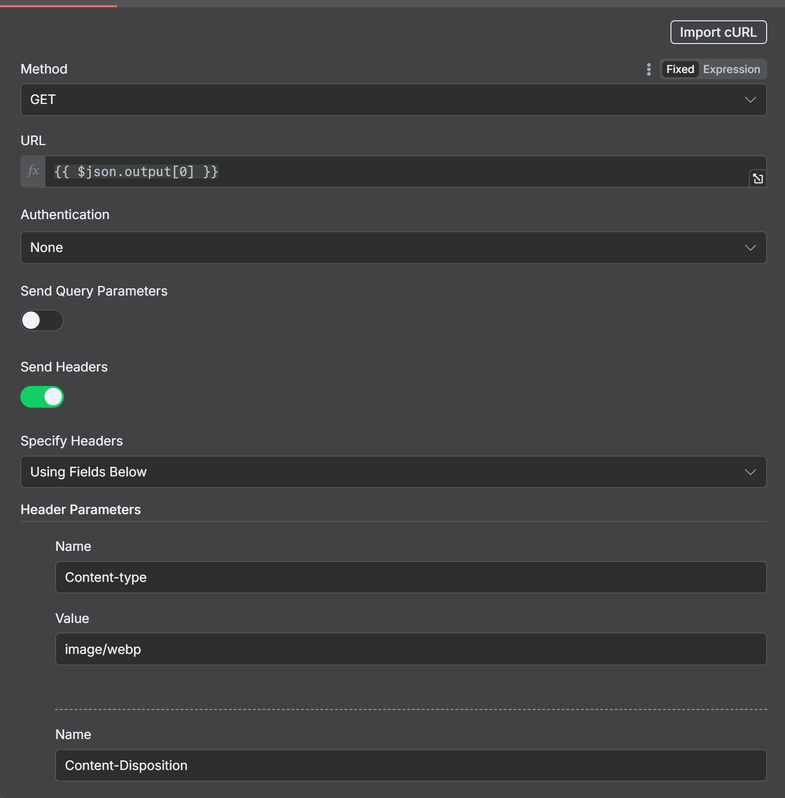
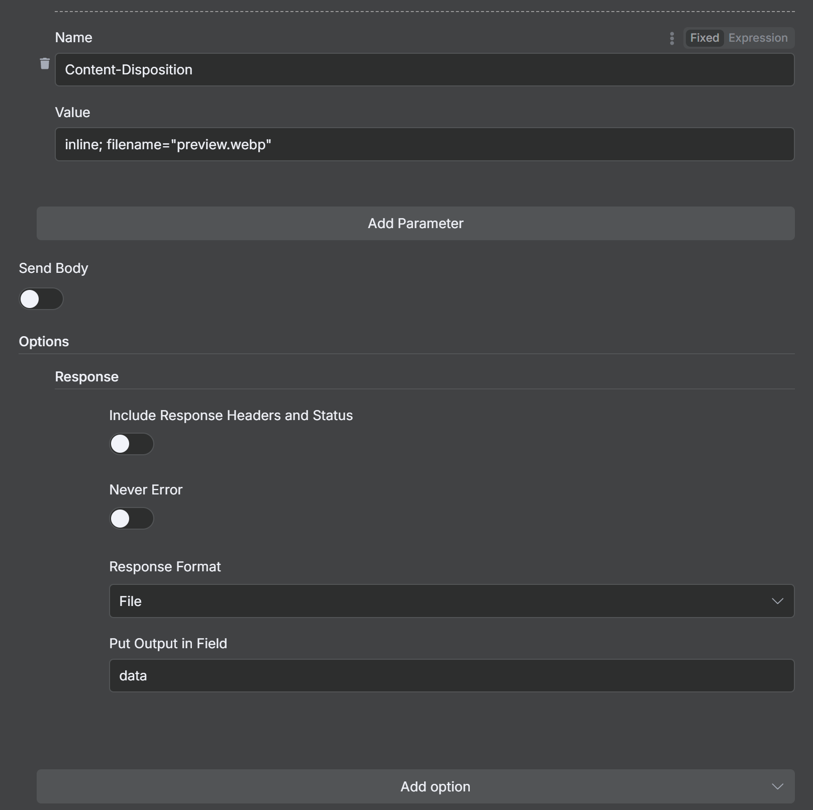

# 🎂 Cake Creator Agent ✨

Welcome to the **Cinematic Cake Creator** 🍰  
Turn your name into a **luxurious cake design** with one click!


---

## 🚀 How It Works

1. ✍️ Enter your **name** in the text field.
2. 📡 The app sends your name to our **AI Cake Webhook** (`POST` method).
3. 🕒 A **loading spinner** will appear while your cake is being baked 🍳.
4. 🎥 Get back a **cinematic cake image** with your name **engraved** on it.
5. ⬇️ Download your custom cake image instantly.

---

## 🖼️ Prompt Format Example

```
You are an expert in creating cake prompts.
I want very simple cake prompts but more elegant and cinematic.

I want you to mention to put {{ $[json.body.name](http://json.body.name/) }} On the cake without any "" marks

Also give me just the plain text of the prompt don't give me anything apart from it keep the prompt in a single line

The name should be engraved on the cake
Make the cake look as cinematic as possible

EG : "black forest gateau cake spelling out the words \"FLUX SCHNELL\", tasty, food photography, dynamic shot"
```

### Create Binary File:




---

I want to create an app which will take the input from the user in the form of text it will be a one line text saying the name of the user.
I'm giving you the web hook link.

### YOUR WEBHOOK LINK

Whenever the user puts in the input you should send the user input to the web hook link get the response back from the web hook link and showcase the image over here.

So basically I'll just explain what my app exactly is. My app is a custom cake name creator whenever the user inputs the name he will get the AI generated cake image with his or her name.

The format should be dark and the theme should be extremely elegant and minimal.
whenever the user sends the input until unless you receive the image from the web hook I want you to give me a loading sign so that the user knows that the image is being created.
Also give me some thinking steps for better UI and Once you receive the image I want you to give me the download button as well so that the user will be able to download the file.

The webhook has been already set to the POST method

---

## ✨ UI Flow Ideas

- **Input Field:** One-line text box for the user’s name.
- **Loading State:** Show a spinner 🔄 with text like:
  - “Mixing the ingredients…” 🥄
  - “Baking your cake…” 🍰
  - “Adding cinematic frosting…” ✨
- **Image Display:** Once webhook returns the image, show it in a **dark, minimal, elegant frame**.
- **Download Button:** 🎁 A clear button to **download your cake image**.

---

## 🖤 Theme & Style

- Dark background 🖤
- Minimalistic layout 🎯
- Cinematic and elegant vibes 🎬✨

---

### 📌 Final Workflow in Action

1. User types name → `POST` to webhook.
2. App shows **loading animations**.
3. App receives **cake image**.
4. User sees the image → clicks **Download Button** ⬇️.
