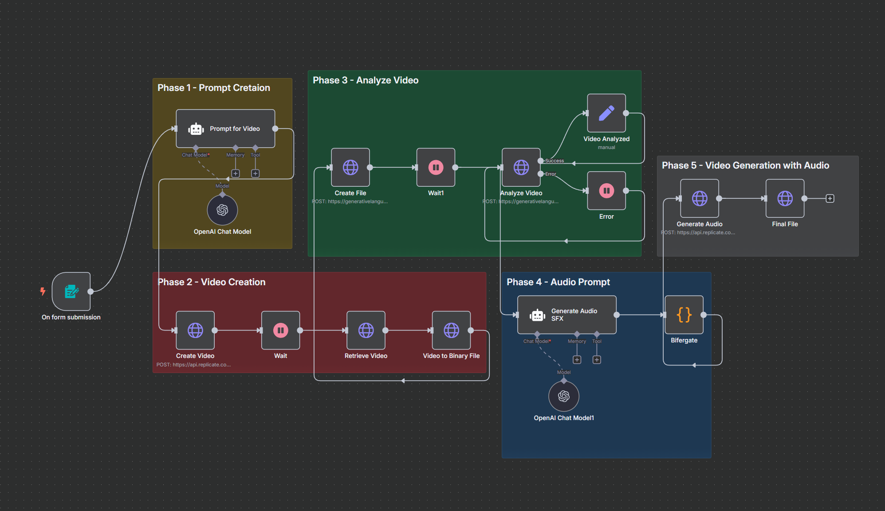
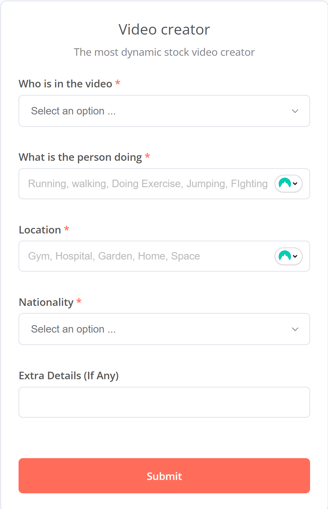
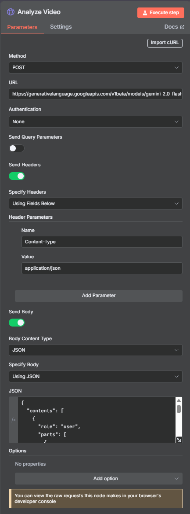
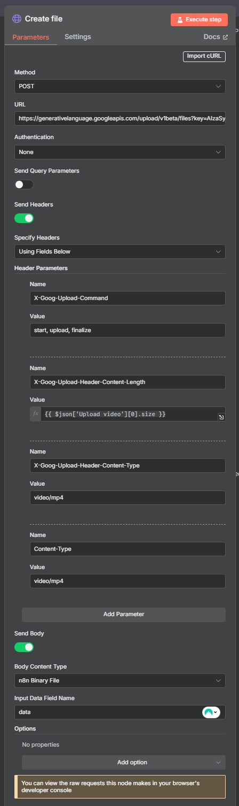

# 🎥 VEO 3 KILLER AGENT 🚀

A complete workflow for **AI-driven Video + Audio Generation & Analysis** using **Replicate** and **Gemini API**.  
This pipeline takes you from **prompt generation ➝ video creation ➝ analysis ➝ audio design ➝ audio generation**.



---

## ⚡ Phase 1 : Prompt Generator 🎬

**AI Role:**  
👉 You are a **Most Versatile Prompt Generator** for **stock video style videos**.  
👉 No dialogues, no talking, just **actions + locations + ambiance**.



📌 **Prompt Template**

```text
You are a Most versatile prompt generator.
I want you to generate prompts without any dialogues.
So basically you are a prompt generator who will generate prompt for this stock video style videos.


The person in the video will be {{ $json['Who is in the video '] }}

The action that person will be doing is {{ $json['What is the person doing '] }}

The specific location will be {{ $json['Location '] }}

And the nationality of the person will be {{ $json.Nationality }}

Some extra details here {{ $json['Extra Details (If Any)'] }}

Based on this I want you to generate a prompt for me not too complicated but at least two 3 line prompt for an AI to understand in the most simplest way.

See towards it that in the prompt you don't mention anything with people talking or anything that is related to voice. I want you to generate prompt only for this stockt video style videos.

give me just the plain text of the prompt

```

🔑 **Instruction:**

- Generate **2-3 lines** of a clear, simple prompt.
- Keep it **visual**, **no dialogues**, **no sound/voice references**.

---

## 🎞️ Phase 2 : Create Video

Generate the video using **Replicate**:
👉 [https://replicate.com](https://replicate.com/)

---

## 🔍 Phase 3 : Analyze Video with Gemini API 🤖

Use **Gemini API** to **describe the entire video in detail**.

👉 Docs: [Gemini API – Google AI](https://ai.google.dev/gemini-api/docs)




📌 **Request JSON**

```json
{
  "contents": [
    {
      "role": "user",
      "parts": [
        {
          "fileData": {
            "fileUri": "{{ $json.file.uri }}",
            "mimeType": "{{ $json.file.mimeType }}"
          }
        },
        {
          "text": "Describe what's going on in the video in great detail. Describe the entire video."
        }
      ]
    }
  ]
}
```

---

## 🎧 Phase 4 : Audio Prompt Generator 🎶

**AI Role:**
👉 You are the **SFX & Audio Prompt Generator**.
👉 Based on `{{ $json['Description '] }}`, you generate **audio design details**.

📌 **Format Example:**

```
You are the SFX and Audio prompt generator.
Based on the given {{ $json['Description '] }}
I want you to give me the audio details

example :
caption : Plastic Debris Handling

cot : Begin with the sound of hands scooping up loose plastic debris, followed by the subtle cascading noise as the pieces fall and scatter back down. Include soft crinkling and rustling to emphasize the texture of the plastic. Add ambient factory background noise with distant machinery to create an industrial atmosphere.

Based on the description given I want you to give me the audio details for it.
See towards it that you study the ambiance and then give me the audio details.

Give me just the plain text

Don't just write 'begin with' Study the {{ $json['Description '] }} Thoroughly and then give me the sound

See Towards the subject action and then create the sound.

Give me one caption for it and one cot
```

🔑 **Guidelines:**

- Study the **description thoroughly**.
- Capture the **ambiance + subject action**.
- Output should include:

  - **Caption** (short title)
  - **Cot** (Chain of Thought – full audio description)

---

## 🛠️ Code Node (Caption + Cot Extractor)

```jsx
const input = $json["output"];

if (!input || typeof input !== "string") {
  return [
    {
      json: {
        error: "No valid 'output' field found in input.",
        inputReceived: input,
      },
    },
  ];
}

// Regex to match 'Caption:' and 'Cot:' (case-insensitive, tolerates real or escaped newlines)
const captionMatch = input.match(/caption:\s*([^\n]*)/i);
const cotMatch = input.match(/cot:\s*([\s\S]*)/i);

return [
  {
    json: {
      caption: captionMatch ? captionMatch[1].trim() : "",
      cot: cotMatch ? cotMatch[1].trim() : "",
    },
  },
];
```

---

## 🔊 Phase 5 : Create Audio

Generate **realistic sound effects** from the prompt using:
👉 [zsxkib/thinksound – Replicate](https://replicate.com/zsxkib/thinksound)

---

## 🎯 Final Workflow

1. **Generate Prompt** → (Phase 1)
2. **Create Video** → (Phase 2)
3. **Analyze with Gemini** → (Phase 3)
4. **Generate Audio Prompt** → (Phase 4)
5. **Create Audio** → (Phase 5)

✨ You now have a **full AI-powered video + sound pipeline**!
