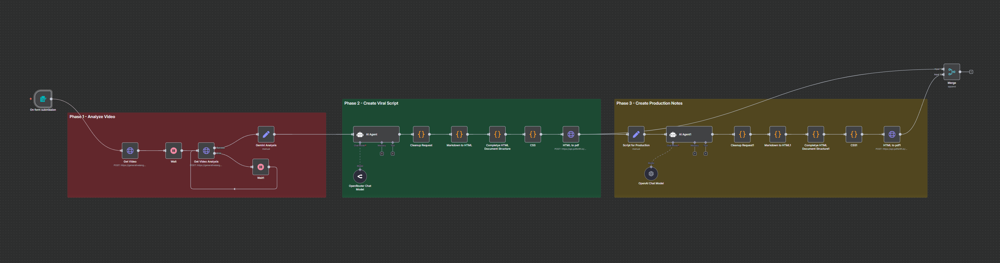

# 🎬 Viral Script Agent



🎬 Viral Video Script & Production Automation (Built with N8N + AI)

---

Welcome to the official documentation for the **"Viral Video Automation Workflow"** — a **3-phase beast** that turns your raw videos into polished scripts, PDFs, and production notes using **N8N + GPT + Gemini + a bit of automation magic**. 🪄

This Notion page breaks it down _block-by-block_ so even your AI-curious cousin can follow along. 👨‍👩‍👧‍👦

---

## 🚀 Overview: What Does This Workflow Do?

This automation helps you:

- 🔍 **Analyze a video** using AI
- ✍️ **Generate a viral-ready script**
- 🎞 **Create production notes**
- 📄 **Export beautiful PDF documents**
- 🔁 All of this happens **on autopilot once a form is submitted!**

---

## 🧱 PHASE 1: Analyze Video Content (Gemini Magic)

🎯 **Goal:** Extract valuable insights from the submitted video

### 🔗 Trigger:

- 📝 A form submission triggers the entire workflow (e.g., Tally or Typeform → Webhook)

### 🛠 Steps:

1. **Get Video - HTTP Node** 📥  
   Pulls the video file or URL submitted from the form.

   ```Javascript
   https://generativelanguage.googleapis.com/upload/v1beta/files?key= YOUR API KEY

   X-Goog-Upload-Command
   start, upload, finalize

   X-Goog-Upload-Header-Content-Length
   {{ $json["Viral Video Input"].size }}

   X-Goog-Upload-Header-Content-Type
   video/mp4

   Content-Type
   video/mp4

   Send Body
   Body Content Type
   n8n Binary File - Input Data Field Name
   Yourname
   ```

Headers & Body setup as per **n8n Binary Input**.

2. **Wait Node** ⏳

   - Gives time for the video to render (buffering logic).

3. **Get Video Analysis - HTTP Node** 🔎
   Sends the video to Gemini for transcription or scene breakdown.

   ```jsx
   https://generativelanguage.googleapis.com/v1beta/models/gemini-2.5-flash:generateContent?key= YOUR API KEY
   ```

   ```Javascript
   {
   "contents": [
    {
      "role": "user",
      "parts": [
        {
          "fileData": {
            "fileUri": "{{ $json.file.uri }}",
            "mimeType": "{{ $json.file.mimeType }}"
          }
        },
        {
          "text": "You are an Instagram content analyst. Analyze videos for viral potential and Instagram optimization"
        }
      ]
    }
   ]
   }

   ```

4. **Gemini Analysis (AI Magic)** ✨

   - Breaks down transcript into **topics, tone, hooks, storytelling angles**.

---

## 🎤 PHASE 2: Create VIRAL YouTube/Instagram Script (GPT-4o Style)

🎯 **Goal:** Turn AI insights into a **viral-ready script** formatted beautifully.

### 💡 Components:

- 🤖 **AI Agent (Claude 4 Sonnet via OpenRouter)**

  - Input: Video analysis + Prompt
  - Output: **3 viral script variations**

  ```JavaScript
  USER PROMPT

    Create 3 distinct Instagram Reel script variations based on this analysis. Provide all 3 scripts in your response without asking for confirmation.

  ANALYSIS:

  **ANALYSIS RESULTS:**
  {{ $json.candidates[0].content.parts[0].text }}

  **USER REQUIREMENTS:**

  - Topic: {{ $('On form submission').item.json['What\'s your topic '] }}
  - Format:{{ $('On form submission').item.json['Target Format '] }}
  - Brand Voice: {{ $('On form submission').item.json['Brand Voice '] }}
  - Target Audience: {{ $('On form submission').item.json['Your target audience '] }}

  **KEY SUCCESSFUL ELEMENTS TO REPLICATE:**
  ✓ Strong curiosity hook ("Mujhe Samaj Nahi Aa Raha")
  ✓ AI/No-code trending topic
  ✓ Clear value proposition (create apps without coding)
  ✓ Fast-paced, visually engaging format
  ✓ Simple, direct CTA ("Comment Magic")
  ✓ Educational content with immediate value

  **CREATE 3 SCRIPT VARIATIONS (30-60 seconds each):**

  For each script, provide:

  **SCRIPT [1/2/3]: [Creative Title]**

  **Hook (0-3 seconds):**
  [Attention-grabbing opening that stops scrolling]

  **Problem Setup (3-15 seconds):**
  [Establish pain point/challenge]

  **Solution Reveal (15-45 seconds):**
  [Show the tool/process with clear value demonstration]

  **Benefits/Social Proof (45-55 seconds):**
  [Quick benefits that make viewers want to save]

  **Call-to-Action (55-60 seconds):**
  [Specific engagement request]

  **Text Overlays:**
  [List 8-10 key text overlays for silent viewing]

  **Visual Direction:**
  [Camera angles, demonstrations, props needed]

  **Hashtag Strategy:**
  [15-20 hashtags: 5 high-competition, 10 medium, 5 low-competition]

  **Hook Variation:**
  [What makes this hook different from the others]

  **Target Audience Angle:**
  [Which segment of your audience this will resonate with most]

  **Viral Prediction Score:** [X/10 with reasoning]

  ---

  **REQUIREMENTS:**

  - Each script must be DISTINCT with different hooks and angles
  - Optimize for Instagram algorithm (high watch time, saves, comments)
  - Include trending elements while staying authentic
  - Focus on mobile viewing experience
  - Make it save-worthy with actionable value
  - Ensure silent viewing compatibility

  **TRENDING ELEMENTS TO CONSIDER:**

  - AI tools are massively trending
  - No-code/automation content performs well
  - Before/after demonstrations get high engagement
  - "Secret" or "hidden" tool reveals drive curiosity
  - Educational content with immediate value gets saved

  Create scripts that feel authentic to the brand voice while maximizing viral potential!

  IMPORTANT: Provide all 3 complete script variations in your response. Do not ask for confirmation or mention that you're creating scripts. Start directly with SCRIPT 1.
  ```

  ```JavaScript
  SYSTEM PROMPT

  You are an expert Instagram script writer and viral content strategist. You specialize in creating high-engagement Reels that stop the scroll, provide value, and drive massive engagement. You understand Instagram's algorithm, trending formats, and what makes content shareable and save-worthy.
  ```

- 🧹 **Cleanup - Code Node**

- Removes AI fluff (e.g., “Would you like me to continue...”)

```JavaScript
  // Clean Claude output - Remove unwanted intro/outro text
  const claudeOutput = $input.first().json.output;

  // Remove common unwanted phrases
  let cleanedOutput = claudeOutput
    .replace(/I'll create \d+ distinct.*?[\n\r]/g, '')
    .replace(/Would you like me to continue.*?$/g, '')
    .replace(/\[Continued in next part.*?\]/g, '')
    .replace(/^.*?focusing on.*?[\n\r]/g, '')
    .trim();

  // Ensure it starts with SCRIPT 1
  if (!cleanedOutput.startsWith('**SCRIPT 1')) {
    const scriptStart = cleanedOutput.indexOf('**SCRIPT 1');
    if (scriptStart > 0) {
      cleanedOutput = cleanedOutput.substring(scriptStart);
    }
  }

  return [{
    ...($input.first().json),
    output: cleanedOutput,
    cleaned: true
  }];
```

- 📝 **Markdown → HTML - Code Node**

- Converts script to structured **HTML**

```JavaScript
  const md = $json.output;

  if (!md) {
    throw new Error('Output field is empty or missing');
  }

  let html = md
    .replace(/^## (.*$)/gim, '<h2>$1</h2>')  // h2 first
    .replace(/^# (.*$)/gim, '<h1>$1</h1>')   // then h1
    .replace(/\*\*(.*)\*\*/gim, '<b>$1</b>') // bold
    .replace(/\*(.*)\*/gim, '<i>$1</i>')     // italic
    .replace(/\n/gim, '<br>');                // line breaks

  return [{ html }];
```

- **Complete HTML Document Structure - Code Node**
  Adds proper document headers, tags, and layout.

```JavaScript
    const rawHtml = $json.html;  // your current HTML output

    const fullHtml = `
    <!DOCTYPE html>
    <html>
    <head>
      <meta charset="UTF-8">
      <title>Converted PDF</title>
    </head>
    <body>
      ${rawHtml}
    </body>
    </html>
    `;

    return [{ html: fullHtml }];
```

- 🎨 **CSS Styling - Code Node**

- Adds beautiful **fonts, colors, layout, and highlights**

```JavaScript
  const rawHtml = $json.html;
<html>
const fullHtml = `
<head>
  <meta charset="UTF-8" />
<!DOCTYPE html>
  <title>AI Agents Mastery with N8N</title>
  <style>
    @import url('https://fonts.googleapis.com/css2?family=Inter:wght@300;400;600;700&family=JetBrains+Mono:wght@400;600&display=swap');
    /* Modern PDF Styling */
    * {
      margin: 0;
      padding: 0;
      box-sizing: border-box;
    }
    body {
      font-family: 'Inter', -apple-system, BlinkMacSystemFont, 'Segoe UI', Roboto, sans-serif;

      font-size: 13px;
      line-height: 1.7;
      color: #1a1a1a;
      margin: 30px 40px;
      background: linear-gradient(135deg, #667eea 0%, #764ba2 100%);
      background-attachment: fixed;

    }
    /* Content Container */
    .content-wrapper {
      background: white;
      border-radius: 12px;
      padding: 40px;
      box-shadow: 0 20px 40px rgba(0,0,0,0.1);
      margin: 20px 0;
    }

    /* Headers with gradient and modern styling */
    h1 {
      font-size: 32px;
      font-weight: 700;
      background: linear-gradient(135deg, #667eea 0%, #764ba2 100%);
      -webkit-background-clip: text;
      -webkit-text-fill-color: transparent;
      background-clip: text;

      margin: 0 0 30px 0;
      padding: 20px 0;
      border-bottom: 3px solid #f1f3f4;
      position: relative;
    }
    h1::after {
      content: '';
      position: absolute;
      bottom: -3px;
      left: 0;
      width: 60px;
      height: 3px;
      background: linear-gradient(135deg, #667eea 0%, #764ba2 100%);

    }
    h2 {
      font-size: 24px;
      font-weight: 600;
      color: #2d3748;
      margin: 35px 0 20px 0;
      padding: 15px 0 15px 20px;
      background: linear-gradient(90deg, #f7fafc 0%, #edf2f7 100%);
      border-left: 4px solid #667eea;

      border-radius: 0 8px 8px 0;
      position: relative;
    }
    h2::before {
      content: '🎯';
      position: absolute;
      left: -2px;
      top: 50%;
      transform: translateY(-50%);
      font-size: 18px;
    }

    h3 {
      font-size: 18px;
      font-weight: 600;
      color: #4a5568;
      margin: 25px 0 15px 0;
      padding: 10px 0;
      border-bottom: 2px solid #e2e8f0;
    }

    /* Paragraphs and text */
    p {
      margin: 0 0 18px 0;
      text-align: justify;
      color: #2d3748;
      font-weight: 400;
    }
    /* Enhanced Lists */

    ul, ol {
      margin: 20px 0 20px 0;
      padding-left: 0;

    }
    li {
      margin-bottom: 12px;
      padding-left: 30px;
      position: relative;
      color: #4a5568;

      line-height: 1.6;
    }
    ul li::before {
      content: '▶';
      position: absolute;
      left: 0;
      color: #667eea;

      font-weight: bold;
      font-size: 12px;
    }
    ol li::before {
      content: counter(item);
      counter-increment: item;
      position: absolute;
      left: 0;

      background: linear-gradient(135deg, #667eea 0%, #764ba2 100%);
      color: white;
      width: 20px;
      height: 20px;
      border-radius: 50%;
      display: flex;
      align-items: center;
      justify-content: center;
      font-size: 11px;
      font-weight: 600;
    }

    ol {
      counter-reset: item;
    }

    /* Enhanced Code Styling */
    code {
      font-family: 'JetBrains Mono', 'Fira Code', Monaco, 'Cascadia Code', monospace;
      background: linear-gradient(135deg, #667eea 0%, #764ba2 100%);
      color: white;
      padding: 4px 8px;
      border-radius: 6px;
      font-size: 12px;
      font-weight: 500;
      letter-spacing: 0.5px;
    }

    pre {
      background: #1a1a1a;
      color: #f8f8f2;
      padding: 20px;
      border-radius: 12px;
      margin: 20px 0;
      overflow-x: auto;
      border: 1px solid #e2e8f0;
      position: relative;
    }

    pre::before {
      content: 'CODE';
      position: absolute;
      top: 8px;
      right: 15px;
      font-size: 10px;
      color: #888;
      font-weight: 600;
      letter-spacing: 1px;
    }

    /* Enhanced Blockquotes */
    blockquote {
      background: linear-gradient(135deg, #f0f9ff 0%, #e0f2fe 100%);
      border-left: 6px solid #0ea5e9;
      margin: 25px 0;
      padding: 20px 25px;
      border-radius: 0 12px 12px 0;
      font-style: italic;
      color: #0c4a6e;
      position: relative;
      box-shadow: 0 4px 6px rgba(0,0,0,0.05);
    }

    blockquote::before {
      content: '"';
      font-size: 60px;
      color: #0ea5e9;
      position: absolute;
      top: -10px;
      left: 15px;
      font-family: Georgia, serif;
      opacity: 0.3;
    }

    /* Bold and Italic */
    strong, b {
      font-weight: 700;
      color: #1a365d;
    }

    em, i {
      font-style: italic;
      color: #2b6cb0;
    }

    /* Special Elements */
    .highlight {
      background: linear-gradient(120deg, #a8edea 0%, #fed6e3 100%);
      padding: 3px 6px;
      border-radius: 4px;
      font-weight: 600;
    }

    /* Table Styling */
    table {
      width: 100%;
      border-collapse: collapse;
      margin: 25px 0;
      background: white;
      border-radius: 12px;
      overflow: hidden;
      box-shadow: 0 4px 6px rgba(0,0,0,0.05);
    }

    th {
      background: linear-gradient(135deg, #667eea 0%, #764ba2 100%);
      color: white;
      padding: 15px;
      text-align: left;
      font-weight: 600;
    }

    td {
      padding: 15px;
      border-bottom: 1px solid #e2e8f0;
    }

    tr:nth-child(even) {
      background: #f8fafc;
    }

    /* Links */
    a {
      color: #667eea;
      text-decoration: none;
      font-weight: 600;
      border-bottom: 2px solid transparent;
      transition: all 0.3s ease;
    }

    a:hover {
      border-bottom-color: #667eea;
    }

    /* Print Optimization */
    @media print {
      body {
        background: white !important;
        margin: 20px;
      }

      .content-wrapper {
        box-shadow: none;
        border-radius: 0;
        padding: 20px;
      }

      h1, h2 {
        page-break-after: avoid;
      }

      pre, blockquote, table {
        page-break-inside: avoid;
      }
    }

    /* Utility Classes */
    .text-center { text-align: center; }
    .text-right { text-align: right; }
    .mb-lg { margin-bottom: 30px; }
    .mt-lg { margin-top: 30px; }

    /* Custom Script Sections */
    .script-section {
      background: linear-gradient(135deg, #f8fafc 0%, #e2e8f0 100%);
      border: 2px solid #cbd5e0;
      border-radius: 12px;
      padding: 25px;
      margin: 25px 0;
      position: relative;
    }

    .script-section::before {
      content: '🎬';
      position: absolute;
      top: -15px;
      left: 20px;
      background: white;
      padding: 0 10px;
      font-size: 20px;
    }

    .cta-box {
      background: linear-gradient(135deg, #667eea 0%, #764ba2 100%);
      color: white;
      padding: 20px;
      border-radius: 12px;
      text-align: center;
      margin: 30px 0;
      box-shadow: 0 8px 16px rgba(102, 126, 234, 0.3);
    }

    .cta-box h3 {
      color: white;
      margin-bottom: 10px;
    }
  </style>
</head>
<body>
  <div class="content-wrapper">
    ${rawHtml}
  </div>
</body>
</html>
`;

return [{ html: fullHtml }];
```

- 📄 **HTML → PDF (via pdfshift.io) [pdfShift.io](https://pdfshift.io/)**

- Generates **shareable PDF scripts**

✅ Output = **3 Viral Script Variations PDF**

---

## 🛠 PHASE 3: Generate PRODUCTION NOTES 🎞

🎯 **Goal:** Help your editor/team understand **how to shoot the script**.

### Breakdown:

1. 🏗 **Script → Prompt Builder**

- Viral script gets expanded into production requirements

2. 🤖 **AI Agent (GPT-4o)**

- Produces **detailed filming guide**:

  - 🎥 Camera angles
  - 💡 Lighting setup
  - 🎭 Talent direction
  - 📱 Mobile filming hacks

```JavaScript
  USER PROMPT

Create a comprehensive production guide for these Instagram scripts:

**GENERATED SCRIPTS:**
{{ $json.Script }}

**FORMAT:** {{ $('On form submission').item.json['Target Format '] }}
**TOPIC:** {{ $('On form submission').item.json['What\'s your topic '] }}
**BRAND VOICE:** {{ $('On form submission').item.json['Brand Voice '] }}

**PROVIDE DETAILED GUIDANCE FOR:**

## 📱 **MOBILE FILMING SETUP**
**Equipment Needed:**
- Smartphone recommendations
- Basic lighting equipment
- Audio equipment
- Stabilization tools

**Camera Settings:**
- Resolution and frame rate for Instagram
- Aspect ratio optimization (9:16 for Reels)
- Focus and exposure tips

## 🎬 **SHOT-BY-SHOT FILMING GUIDE**
For each script section (Hook, Problem, Solution, Benefits, CTA):
- Camera angles and movements
- Lighting setup requirements
- Background and prop suggestions
- Talent direction and energy level
- B-roll footage needed

## 📝 **TEXT OVERLAY STRATEGY**
- Timing for each text overlay
- Font styles that work on mobile
- Color schemes for readability
- Animation suggestions
- Positioning for different phone sizes

## 🎵 **AUDIO STRATEGY**
- Trending audio options for the topic
- Original audio vs trending music decision
- Voiceover recording tips
- Audio levels and mixing
- Silent viewing optimization

## ✂️ **EDITING TIMELINE**
- Cut points and pacing
- Transition effects that work on mobile
- Color grading for Instagram
- Export settings for best quality
- File size optimization

## 📊 **INSTAGRAM OPTIMIZATION**
- Best times to post for this content type
- Hashtag placement strategy
- Caption optimization
- Story highlights integration
- Cross-promotion tactics

## 🚀 **PRO TIPS**
- Advanced mobile filming techniques
- Quick editing hacks
- Engagement boosting strategies
- Algorithm optimization secrets
- Content series potential

**Make everything actionable for someone with basic equipment and no professional video experience!**
```

3. 📝 **Formatting → Markdown → HTML → CSS → PDF**

- Same as Phase 2

✅ Output = **Production Notes PDF**

---

## 📎 Final Output

Your workflow generates:

- ✅ Viral Script PDF 📄
- ✅ Production Notes PDF 🎬
- ✅ Merged/Exported Bundle 📦
- ✅ Upload-ready for **Notion, Google Drive, or Email** 📤

---

## 🧠 Tech Stack Used

| 🛠 Tool                          | 📌 Role                   |
| ------------------------------- | ------------------------- |
| 🔗 N8N                          | Main workflow engine      |
| 📝 Claude 4 Sonnet (OpenRouter) | Script + Notes generation |
| 🔮 Gemini Pro                   | Video analysis            |
| 🖨 HTML-to-PDF API               | Document export           |
| 🪶 Markdown                     | Structured AI output      |

---

## 🤯 Bonus Use Cases

You can tweak this system to:

- 🎙 Convert **podcasts → social clips**
- 🎥 Repurpose **webinars → lead magnets**
- 🐦 Build **tweet threads from interviews**
- 📲 Generate **Instagram captions from blogs**
