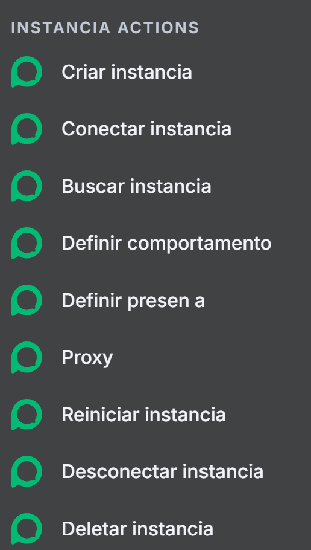
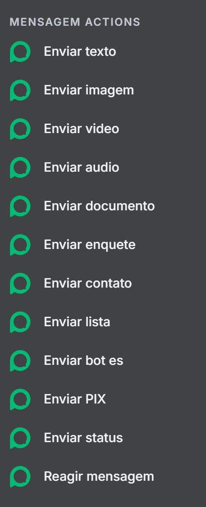
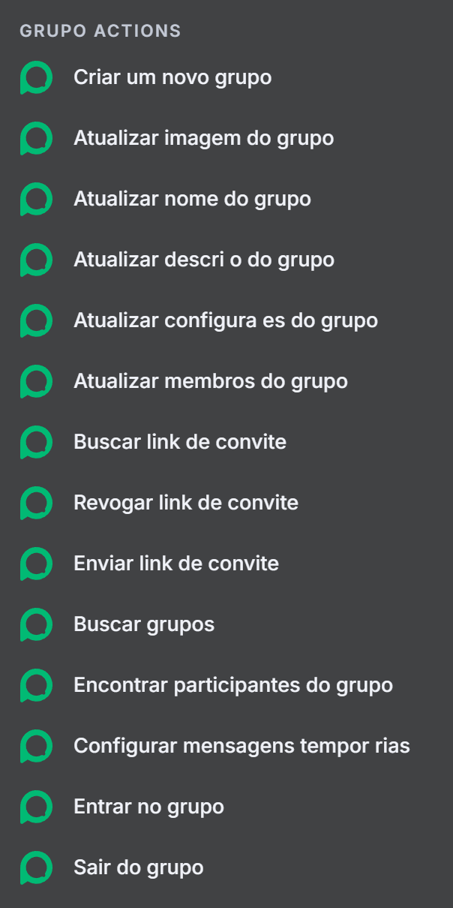
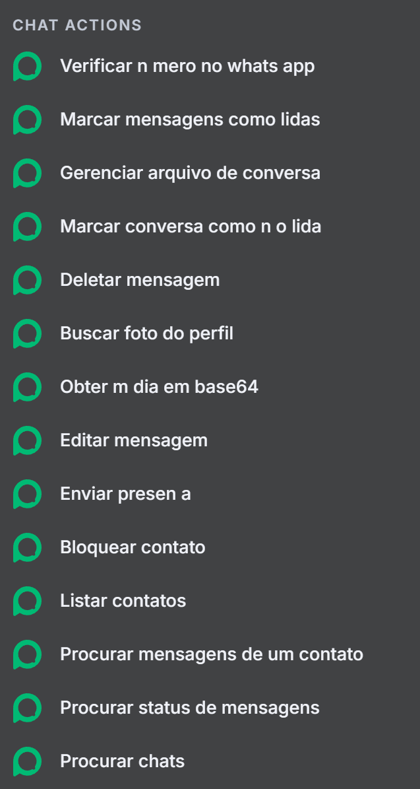
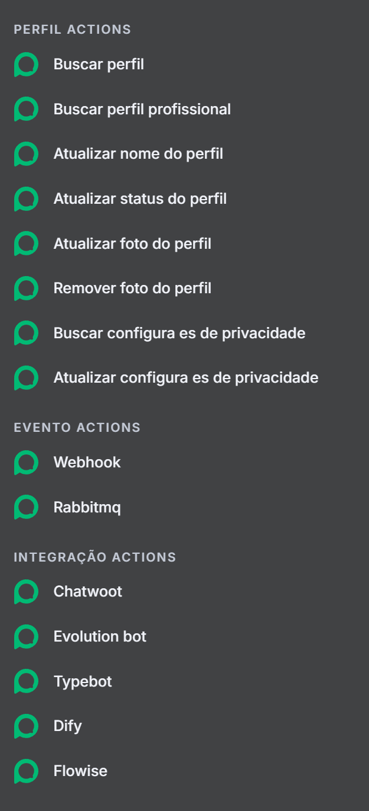

# 💬 WhatsApp AI Agent Documentation

> 🚀 **Build & Automate Smart WhatsApp Conversations** using the **Evolution API** — Connect, Send, Manage, and Integrate powerful AI-driven chat experiences with ease!

---

## ⚙️ **INSTANCE ACTIONS**

🧩 Manage your WhatsApp bot instances effortlessly:

- 🟢 **Create Instance**
- 🔗 **Connect Instance**
- 🔍 **Search Instance**
- 🤖 **Set Behavior**
- 💬 **Set Presence**
- 🌐 **Configure Proxy**
- 🔄 **Restart Instance**
- 🔌 **Disconnect Instance**
- ❌ **Delete Instance**

---

## 💌 **MESSAGE ACTIONS**

📤 Send any type of message directly through WhatsApp:

- 📝 **Send Text**
- 🖼️ **Send Image**
- 🎥 **Send Video**
- 🎧 **Send Audio**
- 📄 **Send Document**
- 📊 **Send Poll**
- 👤 **Send Contact**
- 🧾 **Send List**
- 🔘 **Send Buttons**
- 💸 **Send PIX** _(Brazilian Instant Payment)_
- 📢 **Send Status**
- ❤️ **React to Message**

---

## 👥 **GROUP ACTIONS**

🛠️ Manage and interact with WhatsApp Groups:

- 🆕 **Create Group**
- 🖼️ **Update Group Image**
- ✏️ **Update Group Name**
- 🗒️ **Update Group Description**
- ⚙️ **Update Group Settings**
- 👥 **Manage Members**
- 🔗 **Get Invite Link**
- 🧨 **Revoke Invite Link**
- 📩 **Send Invite Link**
- 🔍 **Search Groups**
- 🧑‍🤝‍🧑 **Find Participants**
- ⏳ **Set Temporary Messages**
- 🚪 **Join Group**
- 📴 **Leave Group**

---

## 💬 **CHAT ACTIONS**

🧠 Handle individual and group chats smartly:

- ✅ **Verify WhatsApp Number**
- 📖 **Mark Messages as Read**
- 🗂️ **Manage Chat Archive**
- 🔔 **Mark Chat as Unread**
- 🗑️ **Delete Message**
- 🖼️ **Get Profile Photo**
- 💾 **Get Media (Base64)**
- ✏️ **Edit Message**
- 📡 **Send Presence**
- ⛔ **Block Contact**
- 👥 **List Contacts**
- 🔍 **Search Messages from Contact**
- 📬 **Check Message Status**
- 💭 **Search Chats**

---

## 👤 **PROFILE ACTIONS**

🧾 Manage your WhatsApp Business or Personal Profile:

- 🔍 **Search Profile**
- 💼 **Search Business Profile**
- ✏️ **Update Profile Name**
- 🗨️ **Update Profile Status**
- 🖼️ **Update Profile Photo**
- ❌ **Remove Profile Photo**
- 🔒 **Get Privacy Settings**
- 🔧 **Update Privacy Settings**

---

## ⚡ **EVENT ACTIONS**

📡 Connect your instance events and automate workflows:

- 🌐 **Webhook Integration**
- 🐇 **RabbitMQ Integration**

---

## 🔗 **INTEGRATION ACTIONS**

🤖 Integrate with other AI and automation tools:

- 💬 **Chatwoot** — Customer Support Automation
- 🧠 **Evolution Bot** — Core WhatsApp AI Engine
- 💬 **Typebot** — Conversational Form Builder
- 🧩 **Dify** — AI Workflow Builder
- 🌀 **Flowise** — Visual AI Agent Flow Designer

---

### 🧭 **Summary**

With this **WhatsApp AI Agent**, you can:
✅ Create automated conversations
✅ Manage WhatsApp groups and profiles
✅ Send multimedia messages
✅ Connect with AI tools like **Flowise**, **Typebot**, and **Dify**

---

> ✨ **Created & Documented by [Chinmay Kaitade](https://github.com/ChinmayKaitade)**
> 🔗 Repository: [N8N AI Agents Masterclass](https://github.com/ChinmayKaitade/N8N-AI-Agents-Masterclass)
> 🌍 Explore • Automate • Innovate
